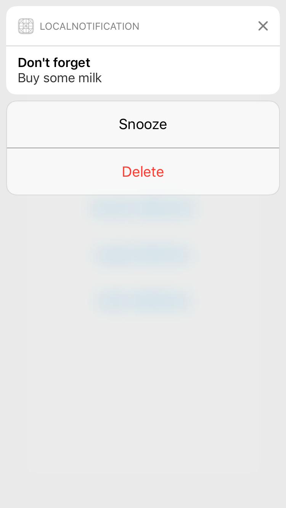
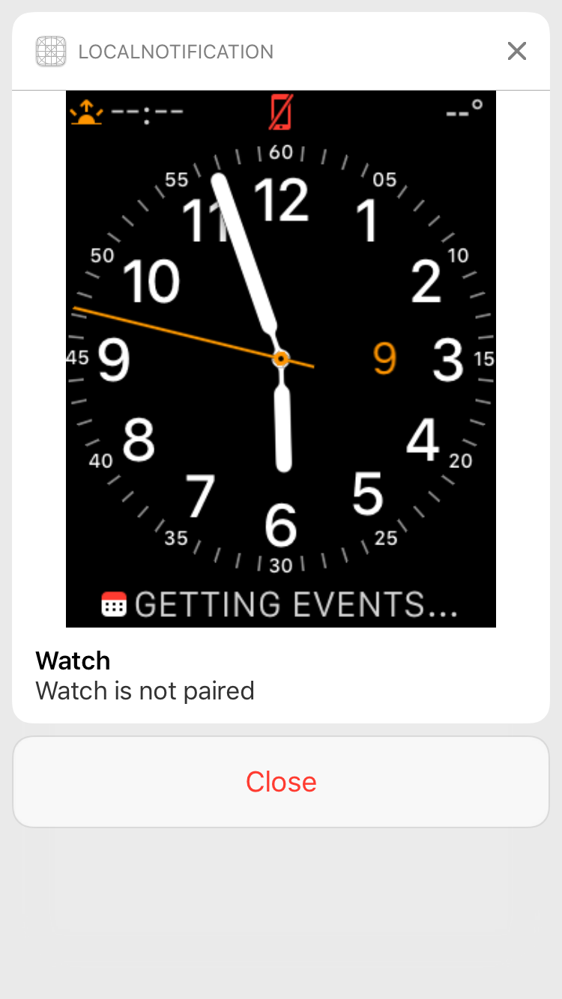
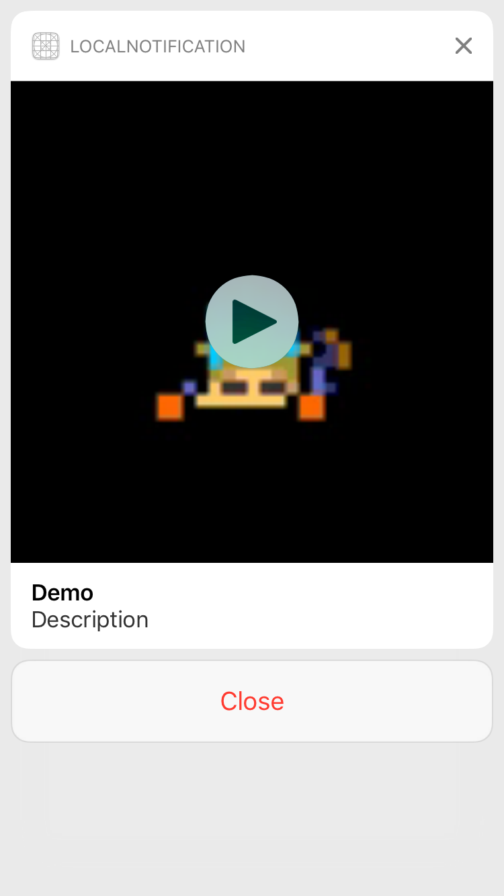

# Local-Notification-Example-iOS10

Example for Local Notification using UserNotifications in iOS 10

## How to build

Just build with Xcode 8.0 and later.

## Contents

### Simple Notification 

Local notification using UserNotifications framework.

 

### Notification with Image 

Local notification with an image using UserNotifications framework.

 

### Notification with Video 

Local notification with an video using UserNotifications framework.

 
